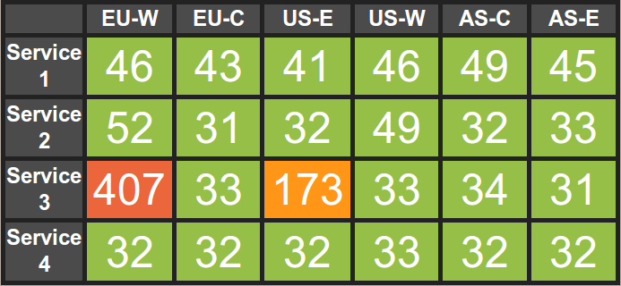

about
=====

Perfboard is a web performance dashboard based on PHP. It's a by-product of my master's thesis, so some parts are more complicated than they neccessarly need to be, on the other hand it's more a proof of concept than a sophisticated product. if you don't like some parts, feel free to contribute.

perfboard consists of three parts:

  1. the sensor(s). a sensor runs on (remote) web server and utilizes [monitoring plugin's](https://www.monitoring-plugins.org/) check_http command to check the performance of a monitored HTTP object.
  2. the collector collects data from the sensors and stores the result into local files for use with the frontend.
  3. the frontend is a simple visualization of the sensor data.

The communication between the collector and the sensors is based on RSA signatures.

installation
============

prerequisites
-------------

before starting, you should generate your RSA keypair. you can do this easily by executing the generate-keypair.sh command in the project's root directory. this will generate a key-pair in your "keys" directory. your identity is a UUID, your keys are named by that UUID. So if youe UUID were 4a2901f3-716c-4522-a03e-959a4acbd04a, it would look like this:

    $ ls keys/
    4a2901f3-716c-4522-a03e-959a4acbd04a.pem
    4a2901f3-716c-4522-a03e-959a4acbd04a.pub

add this to your config.php.

you also need to install the latest monitoring-plugins and mtr package on all hosts, you plan to host your sensors on. In Ubuntu Linux, this can be done by executing

    $ sudo apt-get install nagios-plugins-basic mtr

installing the sensors
----------------------

as long as you point your document root to the sensor/ subdirectory, it should be safe to simple deploy the whole project directory to your webserver. If you like to limit what you deploy, the required files (continuing with 4a2901f3-716c-4522-a03e-959a4acbd04a as your UUID) are:

    keys/
    keys/4a2901f3-716c-4522-a03e-959a4acbd04a.pub
    config.php
    sensor/
    sensor/index.php

if you are utilizing your friend's servers as sensors, you should of course not give away your private key (the .pem-file).

installing the collector and the frontend
-----------------------------------------

collector and frontend need to run on the same file system.

you can run the collector from anywhere you want. depending on how often you like to update your data, adjust your crontab and be happy:

    * * * * * /path/to/perfboard/collector/fetch.php

to installing the frontend, point your web server's document root to /path/to/perfboard/frontend/ with index.php beeing your document index.

--- end of file